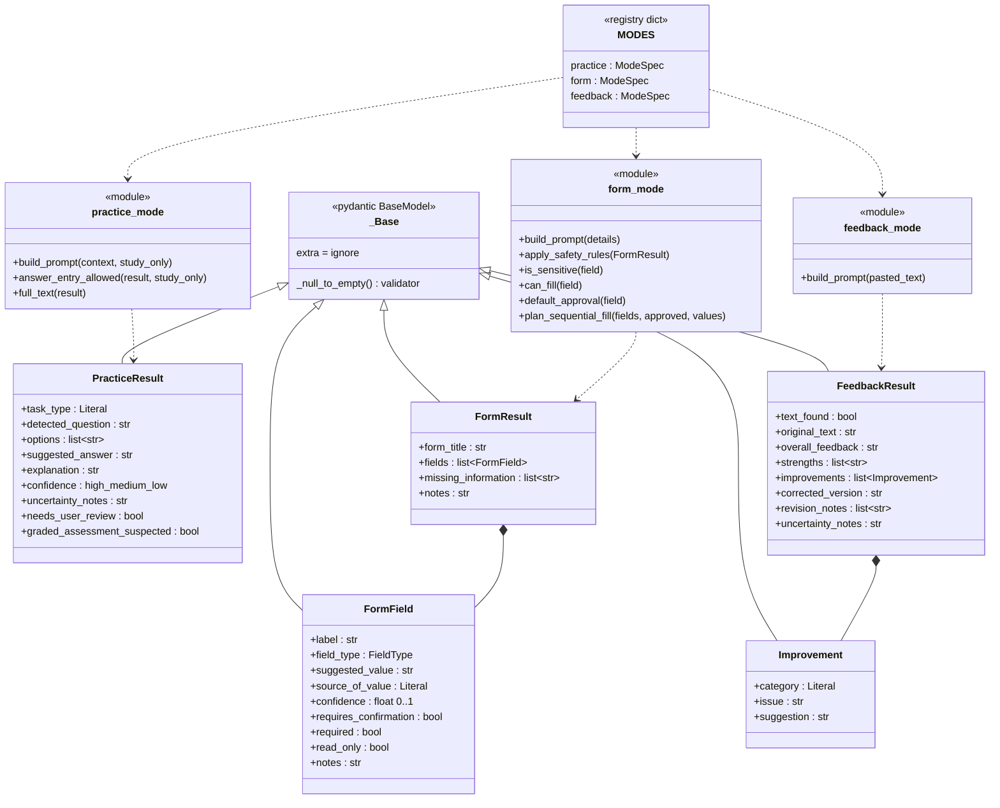

# 6. UML Class Diagram

## 6.1 Core classes

```mermaid
classDiagram
    direction LR

    class CheaterApp {
        <<CustomTkinter CTk>>
        -events : Queue~AgentEvent~
        -controller : AgentController
        -service : GeminiService
        -screens : ScreenshotService
        -automation : AutomationService
        -logger : ActivityLogger
        -_result : BaseModel
        +_start()
        +_pause_resume()
        +_stop()
        +_capture_once()
        +_analyze_text()
        +_retry()
        +_clear()
        -_poll_events()
        -_handle_event(AgentEvent)
        -_render_result(result, meta)
        -_fill_sequence()
        -_confirm_and_fill(steps, question)
        -_select_region()
        -_preview()
    }

    class RegionSelector {
        <<tk Toplevel>>
        +callback(Region)
    }
    class SettingsDialog {
        <<CTkToplevel>>
        +FIELDS
        -_save()
    }

    class AgentController {
        +mode : ModeSpec
        +context : ModeContext
        +settings : AgentSettings
        +events : Queue
        +detector : ScreenChangeDetector
        -_state : AgentState
        -_generation : int
        -_task_seq : int
        -_request_lock : Lock
        -_run : _Run
        -_last_payload : tuple
        -_last_request_at : float
        +state() AgentState
        +busy() bool
        +monitoring() bool
        +can_retry() bool
        +start() bool
        +pause() bool
        +resume() bool
        +stop() bool
        +capture_once() bool
        +analyze_text(text) bool
        +retry() bool
        +clear()
        +set_mode(key) bool
        +set_context(ModeContext)
        +apply_settings(AgentSettings)
        +shutdown()
        -_transition(AgentState) bool
        -_monitor_loop(_Run)
        -_process_change(run, capture, sig)
        -_run_analysis(generation, payload)
        -_one_shot(generation, payload, state)
    }

    class _Run {
        +generation : int
        +stop : Event
        +resume : Event
        +thread : Thread
    }

    class AgentEvent {
        +kind : str
        +task_id : int
        +data : Any
        +extra : dict
    }

    class AgentState {
        <<enumeration>>
        IDLE
        RUNNING
        PAUSED
        PROCESSING
        WAITING_FOR_REVIEW
        ERROR
        STOPPED
    }

    class GeminiService {
        +label : str
        +is_mock : bool
        +request_count : int
        -_blocked_until : float
        +model() str
        +blocked_for() float
        +budget_left() int
        +verify() str
        +ensure_can_send()
        +analyze(AnalysisRequest, should_continue) str
        -_generate(AnalysisRequest) str
        -_thinking_config(types)
    }
    class MockGeminiService {
        +scenario : str
        +latency_s : float
        -_generate(AnalysisRequest) str
    }

    class AnalysisRequest {
        <<frozen dataclass>>
        +mode_key : str
        +system_instruction : str
        +user_prompt : str
        +response_model : type
        +image_png : bytes
    }

    class ModeSpec {
        <<frozen dataclass>>
        +key : str
        +title : str
        +response_model : type
        +supports_text_input : bool
        +pause_for_review : bool
        +build_request(ctx, image_png) AnalysisRequest
        +parse(raw) BaseModel
        +copy_text(result) str
    }
    class ModeContext {
        <<frozen dataclass>>
        +input_text : str
        +study_only : bool
    }

    class ScreenshotService {
        -_region : Region
        -_own_window : tuple
        +set_region(Region)
        +set_own_window(rect)
        +capture() Capture
    }
    class Region {
        +left : int
        +top : int
        +width : int
        +height : int
        +describe() str
    }
    class Capture {
        +image : Image
        +region : Region
        +warnings : tuple
    }

    class ScreenChangeDetector {
        +threshold : float
        +settle_time_s : float
        -_processed : Signature
        -_pending : Signature
        +check(image) ChangeStatus_Signature
        +mark_processed(Signature)
        +reset()
    }
    class Signature {
        +size : tuple
        +cells : bytes
        +digest : str
    }
    class ChangeStatus {
        <<enumeration>>
        UNCHANGED
        SETTLING
        CHANGED
    }

    class AutomationService {
        +cancel : Event
        +run_fill(steps, progress) list~FillOutcome~
        -_check_target(title)
        -_paste(value)
    }
    class FillStep {
        +label : str
        +value : str
        +fill : bool
    }
    class FillOutcome {
        +label : str
        +status : str
    }

    class ActivityLogger {
        +log(message, level) LogEntry
        +info(msg)
        +ok(msg)
        +warn(msg)
        +error(msg)
        +add_listener(fn)
        +entries() list~LogEntry~
    }
    class LogEntry {
        +timestamp : datetime
        +level : str
        +message : str
    }

    class AgentError {
        <<Exception>>
        +category : ErrorCategory
        +message : str
        +hint : str
        +retryable : bool
        +retry_after : float
        +user_text() str
    }
    class ErrorCategory {
        <<enumeration>>
        CONFIG
        AUTH
        RATE_LIMIT
        BUDGET
        NETWORK
        TIMEOUT
        SERVER
        EMPTY_RESPONSE
        MALFORMED_RESPONSE
        UNSUPPORTED_CONTENT
        SCREENSHOT
        AUTOMATION
        CANCELLED
        UNKNOWN
    }

    class AppConfig {
        +api_key : str
        +model : str
        +mock_mode : bool
        +thinking_level : str
        +settings : AgentSettings
        +problem() str
    }
    class AgentSettings {
        +monitor_interval_s : float
        +change_threshold : float
        +settle_time_s : float
        +max_image_side : int
        +request_timeout_s : float
        +max_retries : int
        +min_request_gap_s : float
        +session_request_budget : int
        +clamp() AgentSettings
    }

    CheaterApp *-- AgentController
    CheaterApp *-- GeminiService
    CheaterApp *-- ScreenshotService
    CheaterApp *-- AutomationService
    CheaterApp *-- ActivityLogger
    CheaterApp ..> RegionSelector : opens
    CheaterApp ..> SettingsDialog : opens
    CheaterApp ..> AgentEvent : consumes

    AgentController o-- GeminiService
    AgentController o-- ScreenshotService
    AgentController o-- ActivityLogger
    AgentController *-- ScreenChangeDetector
    AgentController *-- _Run
    AgentController --> AgentState
    AgentController --> ModeSpec : current mode
    AgentController --> ModeContext
    AgentController ..> AgentEvent : produces
    AgentController ..> AgentError : handles

    GeminiService <|-- MockGeminiService
    GeminiService --> AppConfig
    GeminiService ..> AnalysisRequest : sends
    GeminiService ..> AgentError : raises
    ModeSpec ..> AnalysisRequest : builds
    ModeSpec ..> ModeContext : reads

    ScreenshotService ..> Capture : creates
    Capture --> Region
    ScreenChangeDetector ..> Signature
    ScreenChangeDetector ..> ChangeStatus
    AutomationService ..> FillStep : executes
    AutomationService ..> FillOutcome : reports
    ActivityLogger *-- LogEntry
    AgentError --> ErrorCategory
    AppConfig *-- AgentSettings
```

## 6.2 Response models (Pydantic) and mode registry

```mermaid
classDiagram
    direction TB

    class _Base {
        <<pydantic BaseModel>>
        extra = ignore
        _null_to_empty() validator
    }
    class PracticeResult {
        +task_type : Literal
        +detected_question : str
        +options : list~str~
        +suggested_answer : str
        +explanation : str
        +confidence : high_medium_low
        +uncertainty_notes : str
        +needs_user_review : bool
        +graded_assessment_suspected : bool
    }
    class FormResult {
        +form_title : str
        +fields : list~FormField~
        +missing_information : list~str~
        +notes : str
    }
    class FormField {
        +label : str
        +field_type : FieldType
        +suggested_value : str
        +source_of_value : Literal
        +confidence : float 0..1
        +requires_confirmation : bool
        +required : bool
        +read_only : bool
        +notes : str
    }
    class FeedbackResult {
        +text_found : bool
        +original_text : str
        +overall_feedback : str
        +strengths : list~str~
        +improvements : list~Improvement~
        +corrected_version : str
        +revision_notes : list~str~
        +uncertainty_notes : str
    }
    class Improvement {
        +category : Literal
        +issue : str
        +suggestion : str
    }
    class MODES {
        <<registry dict>>
        practice : ModeSpec
        form : ModeSpec
        feedback : ModeSpec
    }
    class practice_mode {
        <<module>>
        +build_prompt(context, study_only)
        +answer_entry_allowed(result, study_only)
        +full_text(result)
    }
    class form_mode {
        <<module>>
        +build_prompt(details)
        +apply_safety_rules(FormResult)
        +is_sensitive(field)
        +can_fill(field)
        +default_approval(field)
        +plan_sequential_fill(fields, approved, values)
    }
    class feedback_mode {
        <<module>>
        +build_prompt(pasted_text)
    }

    _Base <|-- PracticeResult
    _Base <|-- FormResult
    _Base <|-- FormField
    _Base <|-- FeedbackResult
    _Base <|-- Improvement
    FormResult *-- FormField
    FeedbackResult *-- Improvement
    MODES ..> practice_mode
    MODES ..> form_mode
    MODES ..> feedback_mode
    practice_mode ..> PracticeResult
    form_mode ..> FormResult
    feedback_mode ..> FeedbackResult
```
