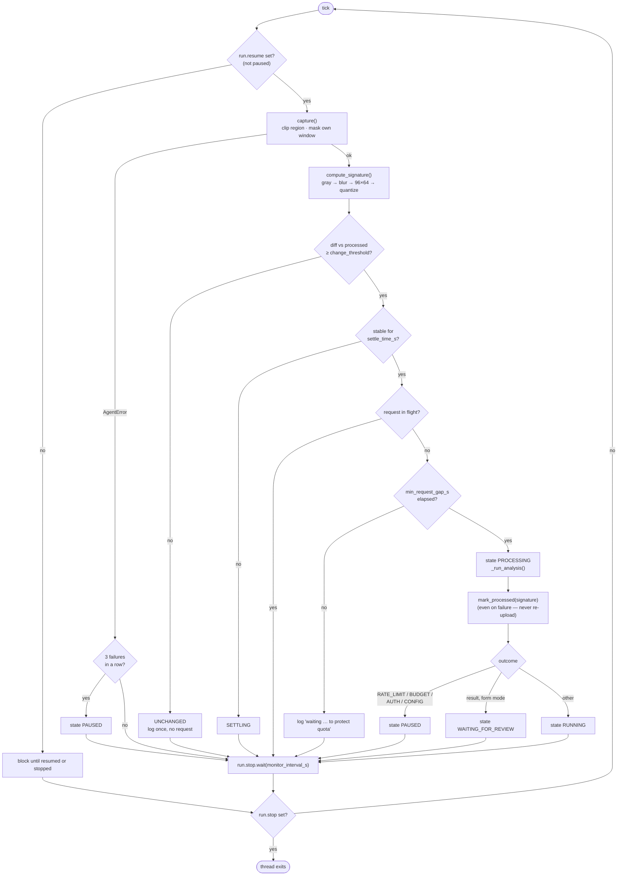
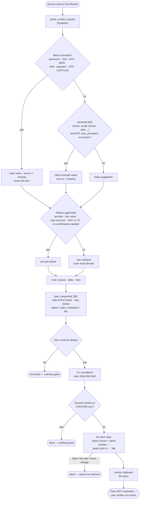
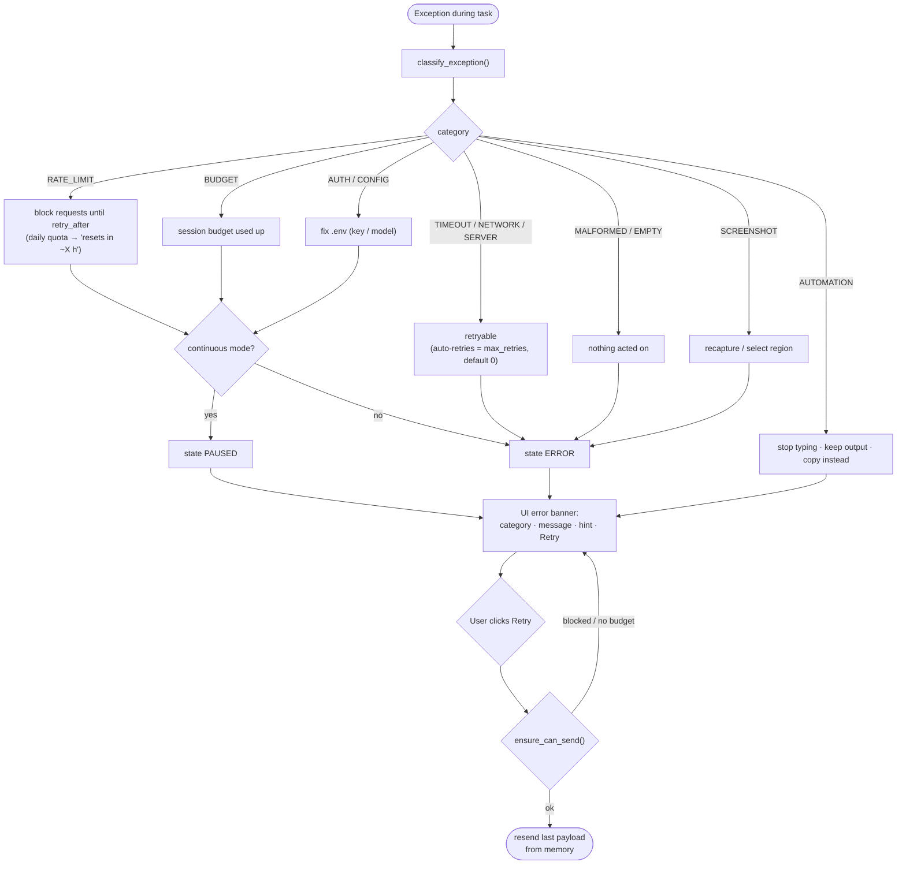

# 8. Activity Diagrams

## 8.1 Continuous monitoring (one iteration of `_monitor_loop`)

```mermaid
flowchart TD
    START(["tick"]) --> R{"run.resume set?<br/>(not paused)"}
    R -->|"no"| WAIT1["block until resumed or stopped"] --> STOPQ
    R -->|"yes"| CAP["capture()<br/>clip region · mask own window"]
    CAP -->|"AgentError"| FAILS{"3 failures<br/>in a row?"}
    FAILS -->|"yes"| PAUSE1["state PAUSED"] --> SLEEP
    FAILS -->|"no"| SLEEP
    CAP -->|"ok"| SIG["compute_signature()<br/>gray → blur → 96×64 → quantize"]
    SIG --> DIFF{"diff vs processed<br/>≥ change_threshold?"}
    DIFF -->|"no"| UNCH["UNCHANGED<br/>log once, no request"] --> SLEEP
    DIFF -->|"yes"| STABLE{"stable for<br/>settle_time_s?"}
    STABLE -->|"no"| SETT["SETTLING"] --> SLEEP
    STABLE -->|"yes"| BUSY{"request in flight?"}
    BUSY -->|"yes"| SLEEP
    BUSY -->|"no"| GAP{"min_request_gap_s<br/>elapsed?"}
    GAP -->|"no"| LOGW["log 'waiting … to protect quota'"] --> SLEEP
    GAP -->|"yes"| PROC["state PROCESSING<br/>_run_analysis()"]
    PROC --> MARK["mark_processed(signature)<br/>(even on failure — never re-upload)"]
    MARK --> OUT{"outcome"}
    OUT -->|"RATE_LIMIT / BUDGET /<br/>AUTH / CONFIG"| PAUSE2["state PAUSED"]
    OUT -->|"result, form mode"| REV["state WAITING_FOR_REVIEW"]
    OUT -->|"other"| RUN["state RUNNING"]
    PAUSE2 --> SLEEP
    REV --> SLEEP
    RUN --> SLEEP
    SLEEP["run.stop.wait(monitor_interval_s)"] --> STOPQ{"run.stop set?"}
    STOPQ -->|"no"| START
    STOPQ -->|"yes"| END(["thread exits"])
```

## 8.2 Form-fill safety pipeline

```mermaid
flowchart TD
    A(["Gemini returns FormResult"]) --> B["parse_model_output()<br/>(Pydantic)"]
    B --> C{"field is sensitive?<br/>password · card · CVV · IBAN ·<br/>SSN · passport · OTP · CAPTCHA"}
    C -->|"yes"| C1["clear value · source = missing<br/>'never fills this'"]
    C -->|"no"| D{"personal field<br/>(name, email, phone, date…)<br/>and NOT user_provided / on screen?"}
    D -->|"yes"| D1["clear invented value<br/>source = missing"]
    D -->|"no"| E["keep suggestion"]
    C1 --> F
    D1 --> F
    E --> F{"default_approval()<br/>text-like · has value ·<br/>user-sourced · conf ≥ 0.75 ·<br/>no confirmation needed"}
    F -->|"yes"| F1["row pre-ticked"]
    F -->|"no"| F2["row unticked<br/>(user must decide)"]
    F1 --> G["User reviews · edits · ticks"]
    F2 --> G
    G --> H["plan_sequential_fill()<br/>start at first ticked · stop before<br/>select / radio / checkbox / file"]
    H --> I{"User confirms dialog?"}
    I -->|"no"| X1(["cancelled — nothing typed"])
    I -->|"yes"| J["3 s countdown<br/>user clicks first field"]
    J --> K{"focused window is<br/>CHEATER.exe?"}
    K -->|"yes"| X2(["abort — nothing typed"])
    K -->|"no"| L["for each step:<br/>check cancel + same window →<br/>paste (ctrl+v) → Tab"]
    L -->|"Stop / fail-safe / focus change"| X3(["abort — report not reached"])
    L --> M["restore clipboard<br/>fill report"]
    M --> N(["Form NOT submitted —<br/>user verifies on screen"])
```

## 8.3 Error handling and recovery

```mermaid
flowchart TD
    E(["Exception during task"]) --> CL["classify_exception()"]
    CL --> T{"category"}
    T -->|"RATE_LIMIT"| RL["block requests until retry_after<br/>(daily quota → 'resets in ~X h')"]
    T -->|"BUDGET"| BU["session budget used up"]
    T -->|"AUTH / CONFIG"| AU["fix .env (key / model)"]
    T -->|"TIMEOUT / NETWORK / SERVER"| TR["retryable<br/>(auto-retries = max_retries, default 0)"]
    T -->|"MALFORMED / EMPTY"| MF["nothing acted on"]
    T -->|"SCREENSHOT"| SC["recapture / select region"]
    T -->|"AUTOMATION"| AM["stop typing · keep output · copy instead"]
    RL --> P{"continuous mode?"}
    BU --> P
    AU --> P
    P -->|"yes"| PA["state PAUSED"]
    P -->|"no"| ER["state ERROR"]
    TR --> ER
    MF --> ER
    SC --> ER
    PA --> BAN["UI error banner:<br/>category · message · hint · Retry"]
    ER --> BAN
    AM --> BAN
    BAN --> RT{"User clicks Retry"}
    RT --> G{"ensure_can_send()"}
    G -->|"blocked / no budget"| BAN
    G -->|"ok"| AG(["resend last payload<br/>from memory"])
```
